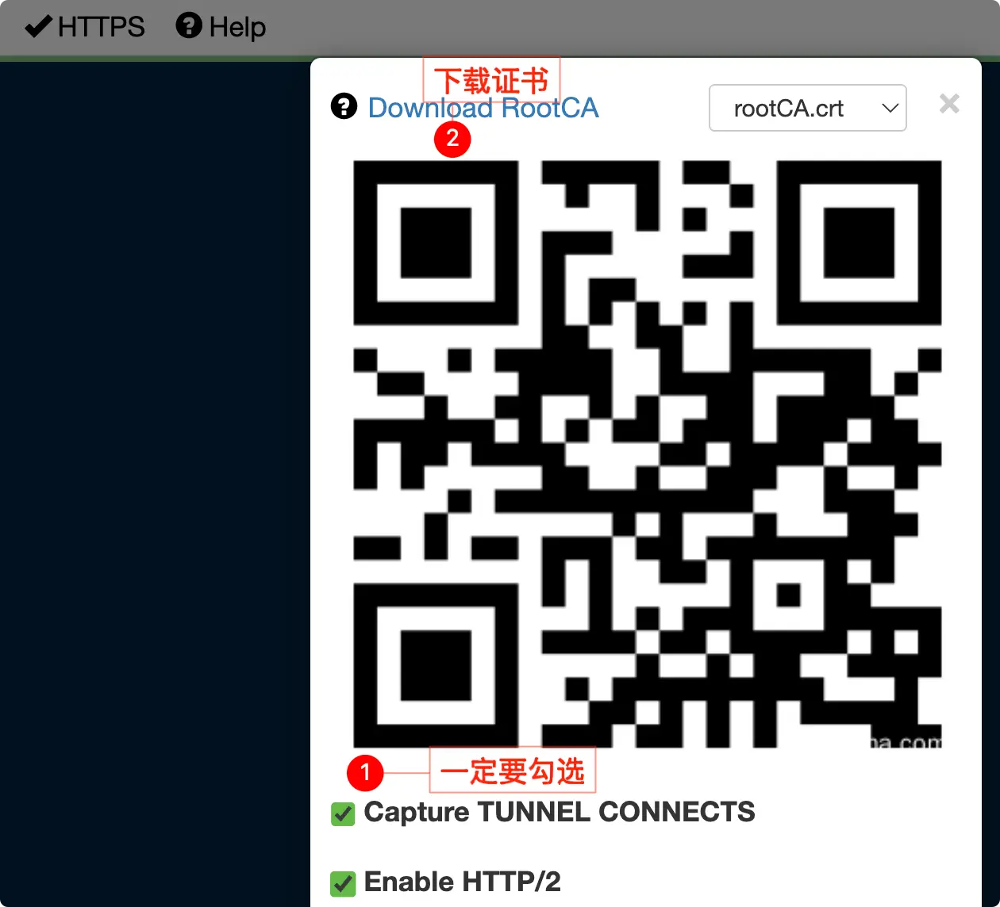
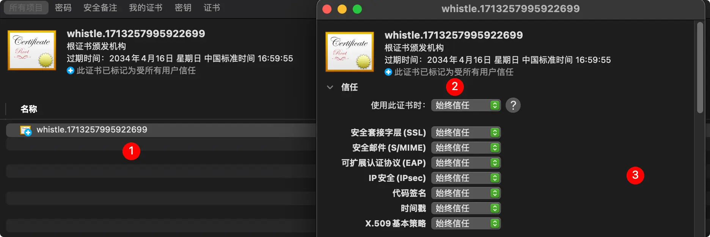

## 好用的软件

- whistle (全平台)
- proxyman (mac)
- surge (mac)


***


## mac 安装 whistle 

也可以下载客户端  [whistle-client](https://github.com/avwo/whistle-client)


有 node 环境可使用 npm 全局安装

```sh
npm i -g whistle
```


启动

```sh
w2 start
```


下载 https 证书


安装 https 证书



## 安装 SwitchyOmega

![[assets/whistle安装和使用/img_0416171819.webp]]

## 测试

打开任意网站，选中刚才设置的代理

![[assets/whistle安装和使用/img_0416171833.webp]]

成功✌️

![[assets/whistle安装和使用/img_0416171931.webp]]


## 跨域处理
设置 reqCors

### 配置

最好是通过变量配置
valures 新建变量 cors
![[assets/whistle安装和使用/img_0416173546.webp]]


## 手机抓包
1. 同一局域网 （手机的Wi-Fi 和电脑在同一网段下）
2. 设置HTTP 代理 (点击Wi-Fi 右边的符号，往下滑动设置)
	1. 先看电脑IP，如 192.168.3.3，就输入这个，然后端口设置 whistle 默认的 8899 端口
3. 扫描刚才上面的二维码
4. 手机下载证书后安装，是一个描述文件，下载后打开设置就能看见，然后点击安装


### 验证
![[assets/whistle安装和使用/img_0416180607.webp]]